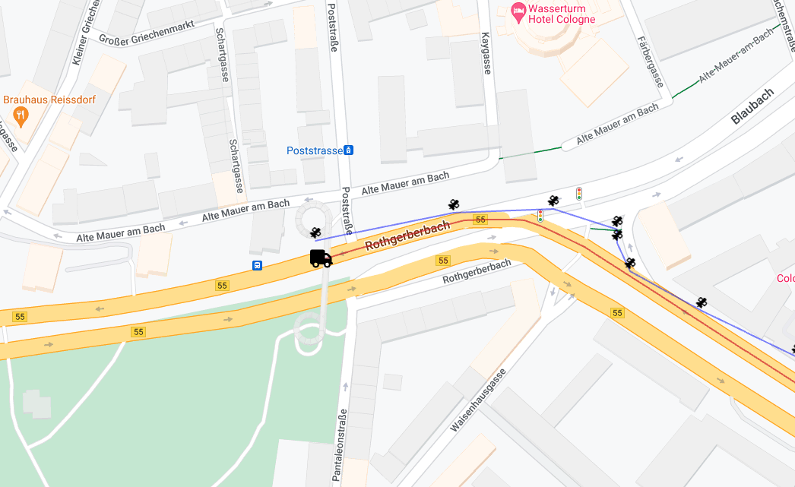

# Roads-API-Demo

How to Smooth Your Driver Location Data &amp; Snap to the Nearest Road

View the hosted version of this app here: [https://pubnub-roads-api-demo.netlify.app/](https://pubnub-roads-api-demo.netlify.app/)

See the how-to which accompanies this application at [https://www.pubnub.com/how-to/smooth-driver-location/](https://www.pubnub.com/how-to/smooth-driver-location/)

## Installing / Getting started

Please see the how-to which accompanies this application at [https://www.pubnub.com/how-to/smooth-driver-location/](https://www.pubnub.com/how-to/smooth-driver-location/) for:

- Full details on getting started
- Setting up your PubNub keys
- Configuring your PubNub function
- Configuring your Google key
- Full context for this application.

## Contributing
Please fork the repository if you'd like to contribute. Pull requests are always welcome.